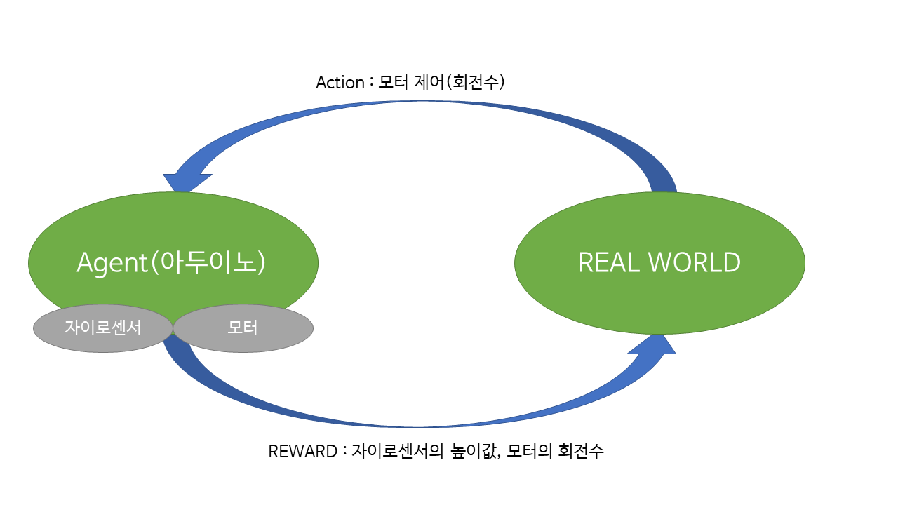

### 학습환경 구성

강화학습은 다음과 같이 생각하고 있음  
실제로 강화학습에 중요한 keypoint인 `Agent` , `Action` , `Environment` , `REWARD` 를 다음과 같이 구성함
* `Agent` : 아두이노가 현실에서 날아야 하는 상황임 , 자이로센서의 높이 데이터와 모터를 가지고 있어야함  
* `Action` : 모터의 회전수에 따라서 높이와 체공 시간이 달라질 것임  
모터를 제어하는 것이 목표임
* `REWARD` : 자이로센서의 높이값을 이용해서 일정한 높이를 유지하도록 만들고, 모터의 회전수를 작게 가저가면서 사용하는 전력의 양을 최소화해서 오랫동안 체공 할 수 있도록 만듬
* `REAL WORLD` : 그냥 진짜 현실에서 날리고 있음?

