# 모터구동

### PC와 아두이노 셋팅
아두이노가 PC와 회로의 통신에 용이하고 PC환경에서 작업을 하는 것이 편해서 아두이노로 진행함

실제로 PC에서 코드에서 부터 실제 모터 구동까지 시도 해봄


PC의 USB 포트를 이용해서 아두이노와 PC를 연결함

> https://www.arduino.cc/en/software

아두이노의 공식 홈페이지에서 파일을 받아서 설치함

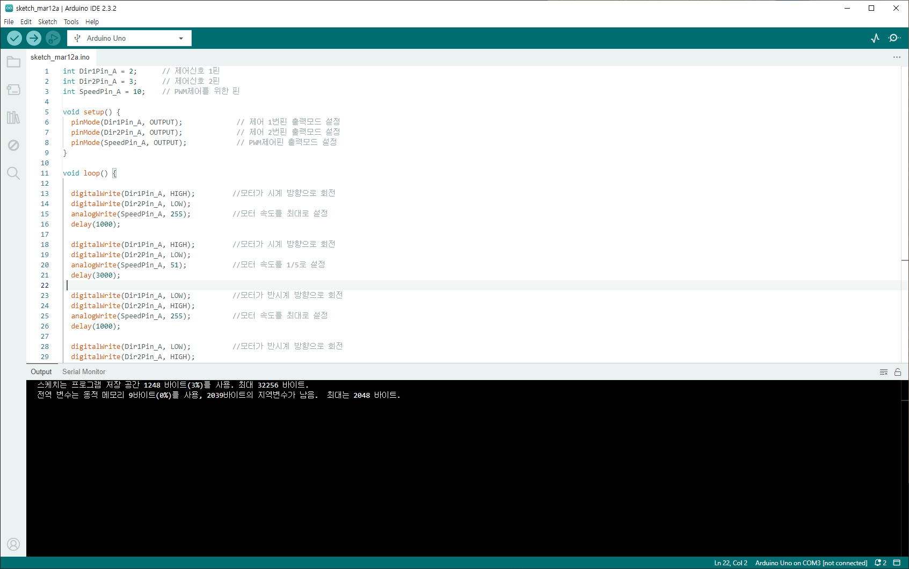

다음과 같은 ID가 설치됨
USB 문제가 있어서 PC와 아두이노의 연결을 확인해야할 때가 있었음  
그럴때 `tool -> Get Board Info`를 실행했을때 다음과 같이 `Please select a port to obtain board info`를 클릭하면 아두이노 보드에 대한 정보가 뜸  
만약에 연결이 안된 경우 에러가 뜸  
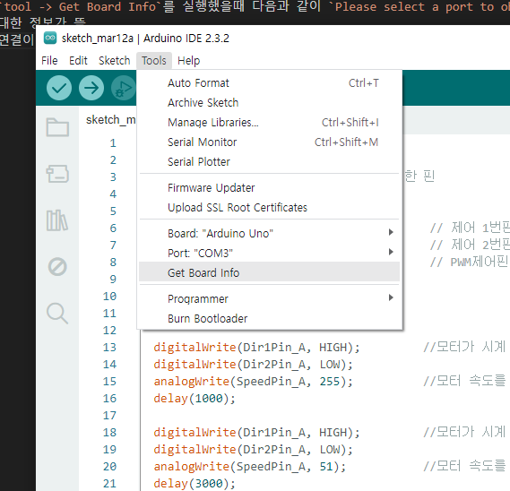

  

정상적으로 연결 했다면 다음과 같이 info창이 뜸  

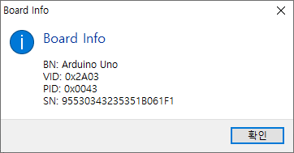

### 강화학습을 위한 하드웨어 구성
강화학습 셋팅 파일에서 환경을 구성하고 이에 따른 필요한 부품들을 구매함


`3축 자이로 센서` : 강화학습에서 높이의 센서값을 측정하기 위한 부품  
`모터 드라이버` : 아직은 자세히는 모르는데 아두이노의 전력이 모터를 돌리기에는 부족해서 전력을 더 쓸려고 사용하는 것 같음  
`각 종 케이블` :    
`배터리` :   
`3축 가속도 센서` : 사는 김에 삼  

### 부품 연결
부품이 도착해서 다음의 예제 사이트를 기반으로 따라 만들어 봄  
> https://codingrun.com/111

  
솔직히 이해는 못했는데 그냥 보이는대로 끼워 넣음  

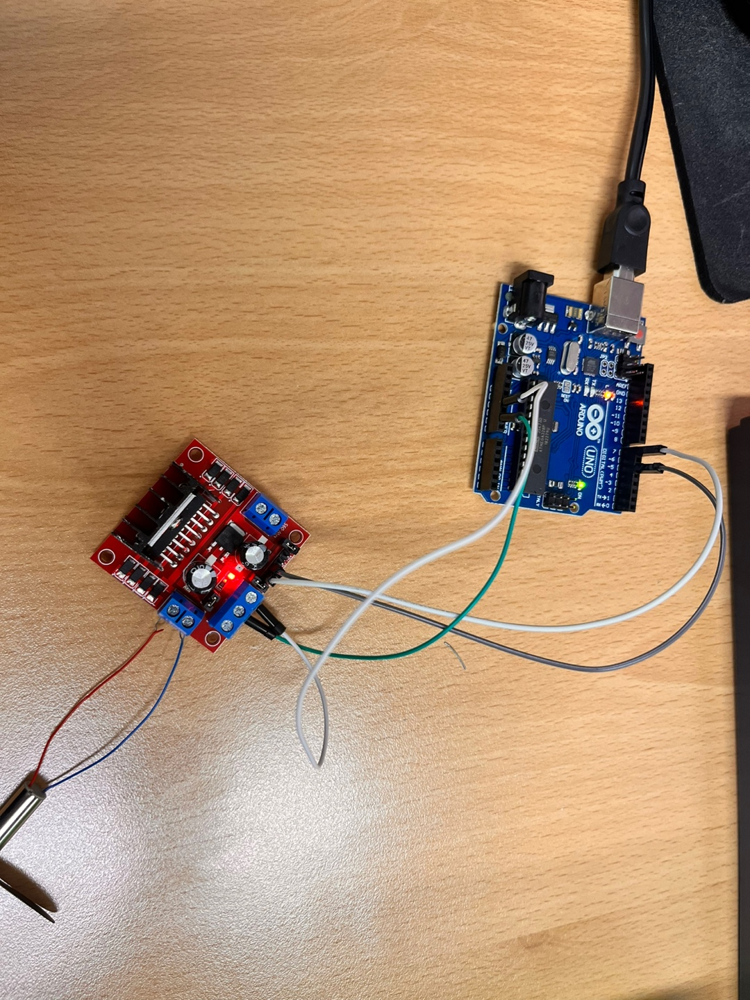
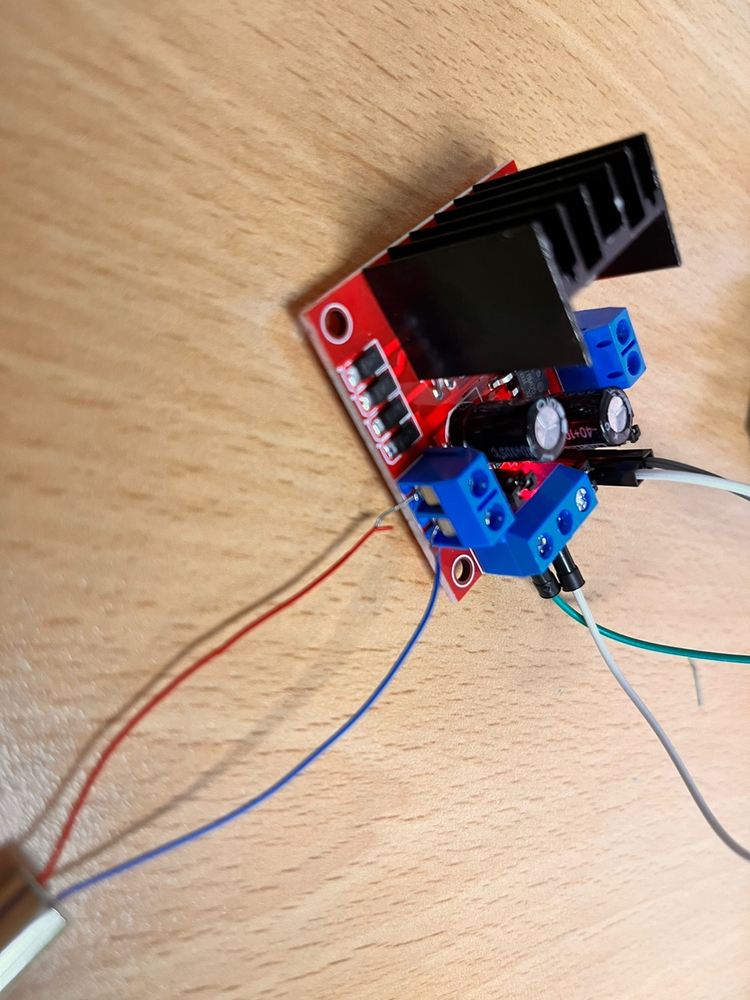
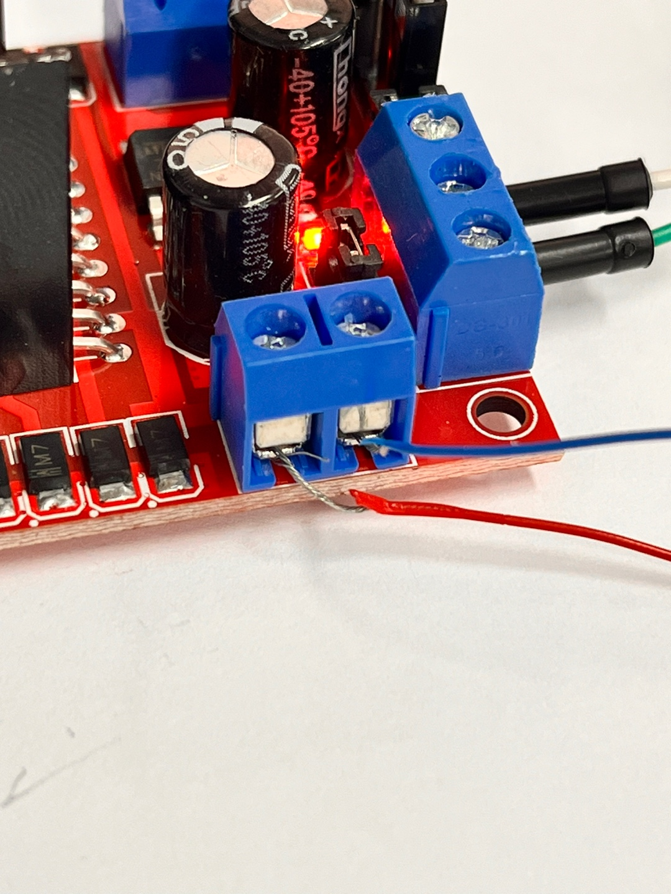

모터 드라이버는 신기하게 연결을 소켓에 피복이 벗겨진 전선을 넣고 위에 있는 나사를 돌려야 하는 구조임   
근데 선만 안의 철에 가져다 대기만해도 모터 드라이버의 빨간색 불이 들어왔음  

### 시리얼 모니터
소스코드를 보면 `시리얼 모니터`를 라는 것을 이용하는데  
이는 PC의 input을 아두이노 보드에 전송해주는 그런 역활을 하는 시스템으로 보임  

시리얼 모니터를 어떻게 사용하는지 알아보기 위해서 다음과 같이 간단한 코드를 작성해서 확인해봄

```C
void setup(){
  Serial.begin(speed);
}

  
void loop(){
  Serial.print("황제드라몬\n");
  delay(1000);

}
```

다음과 같이 아두이노의 IDE에서 시리얼 모니터를 사용 할 수 있음  


아래와 같이 아래의 창에서 문자열이 제대로 나오는 것을 볼 수 있음   
loop문을 이용해서 돌리고 있어서 보드를 끌 때 까지 계속 반복됨  


### 에러의 시작(디버그 시작)

```C
int in1 = 7;  //in1 7踰� �ы듃濡� �쒖뼱 (OUT1)
int in2 = 5;  //in2 5踰� �ы듃濡� �쒖뼱 (OUT2)

void setup() {
  pinMode(in1, OUTPUT); 
  pinMode(in2, OUTPUT); //媛� �ы듃 異쒕젰�쇰줈 �ъ슜
  Serial.begin(9600);  //�쒕━�쇰え�덊꽣 �ъ슜
}

void loop() {
  if(Serial.available())  //�쒕━�쇰え�덊꽣�먯꽌 �곗씠�곌� �ㅼ뼱�ㅻ㈃
  {
    char in_data;         // �낅젰�� �곗씠�� ���μ쓣 �꾪븳 蹂���
    in_data = Serial.read();  //�낅젰�� �곗씠�� in_data�� ����
    if(in_data == '1')    //�낅젰�� �곗씠�곌� '1'�대씪硫�
    {
      digitalWrite(in1, HIGH);
      digitalWrite(in2, LOW);   //�욎쑝濡� �뚯쟾
    }
    else if(in_data == '2') //�낅젰�� �곗씠�곌� '2'�쇰㈃
    {
      digitalWrite(in1, LOW);
      digitalWrite(in2, HIGH);  //�ㅻ줈 �뚯쟾 (�대뼡 諛⑺뼢�쇰줈 苑귥븯�먮깘�� �곕씪�� 諛⑺뼢 諛섎�)
    }
    else  // 洹� �댁쇅�� 媛믪뿉�쒕뒗
    {
      digitalWrite(in1, LOW);
      digitalWrite(in2, LOW);  //�뚯쟾 �뺤�
    }
  }
}
```
다음과 같이 예제에서 주는 소스 코드를 이용해서 실행을 해보니 실행이 안됨  

다음과 같은 경우의 수들을 시도 해봄
* 모터의 +-를 반대로 끼워봄 -> 그래도 안됨
* PC와 아두이노 보드가 연결이 이상한가 -> 아두이노의 보드를 보면 TX, RX를 신호를 주고 받는 것을 LED로 볼 수 있는 데 이것이 정상적으로 동작함  
* 베터리를 바로 모터 드라이버를 끼워봄 -> 그래도 안됨
* 점퍼를 빼서 PWM 코드로 바꿔봄
* 핀을 다른 핀으로 사용해봄

이러한 방법으로는 디버그가 어려웠음  
근본적인 문제에 대한 이해를 바탕으로 디버그를 하는 것이 아닌 주먹구구식으로 접근을 했었음  

### 문제해결
아직도 완전히 이해를 한 것은 아닌데  
지금 다른분들이 문제점으로 말씀 한 것은 다음과 과 같음  
전류의 강압문제?  
나는 이거를 배터리가 너무 많은 전력을 줘서 회로가 자기 자신으 보호할려고 적은 전류를 사용하고 있는 것으로 이해하를 하고 있음  

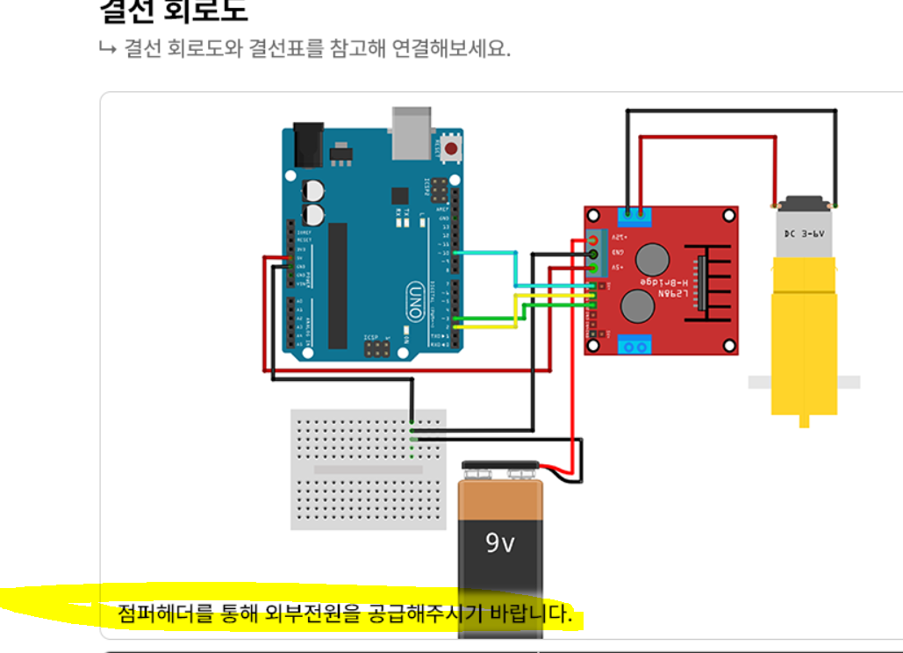
공식 홈페이지에 있는 회로도와 소스 코드를 구성해서 해보니 정상적으로 동작을 했음  


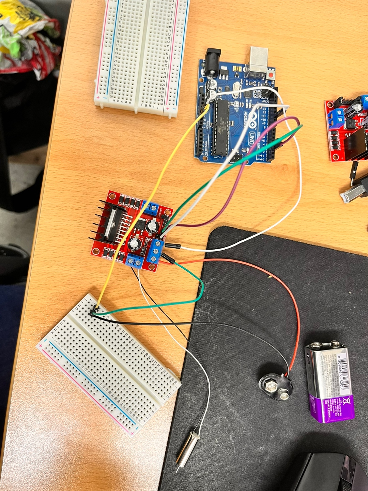
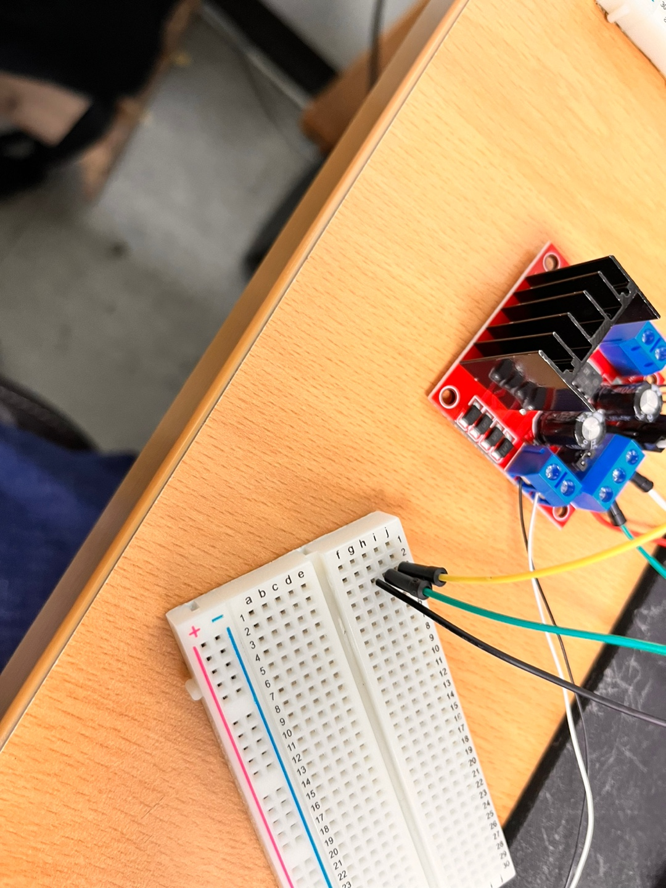
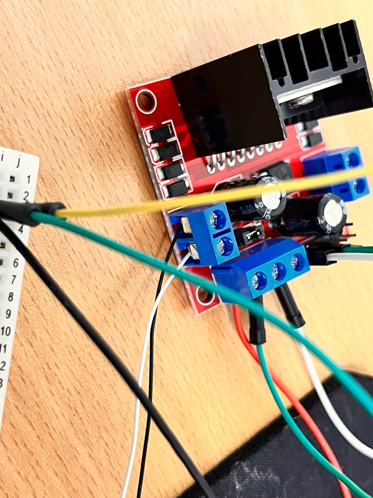
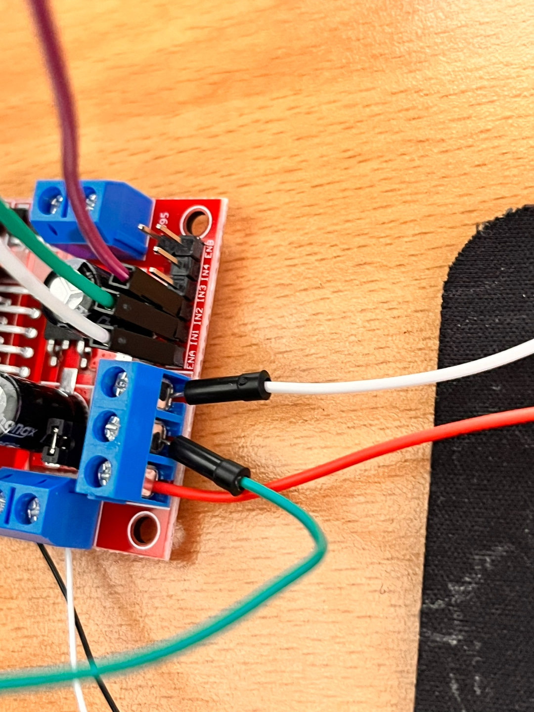
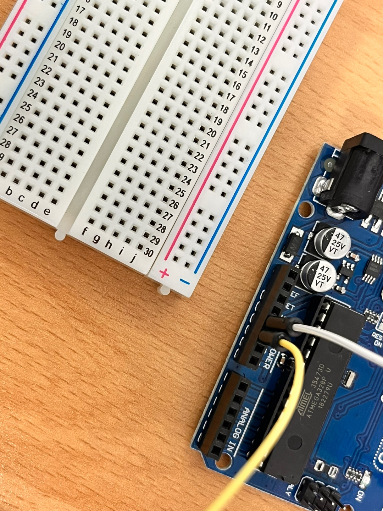
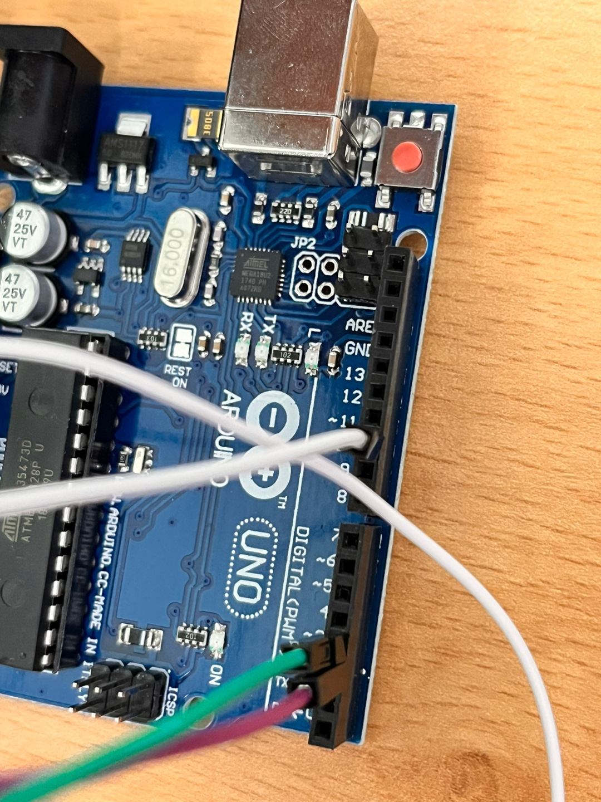
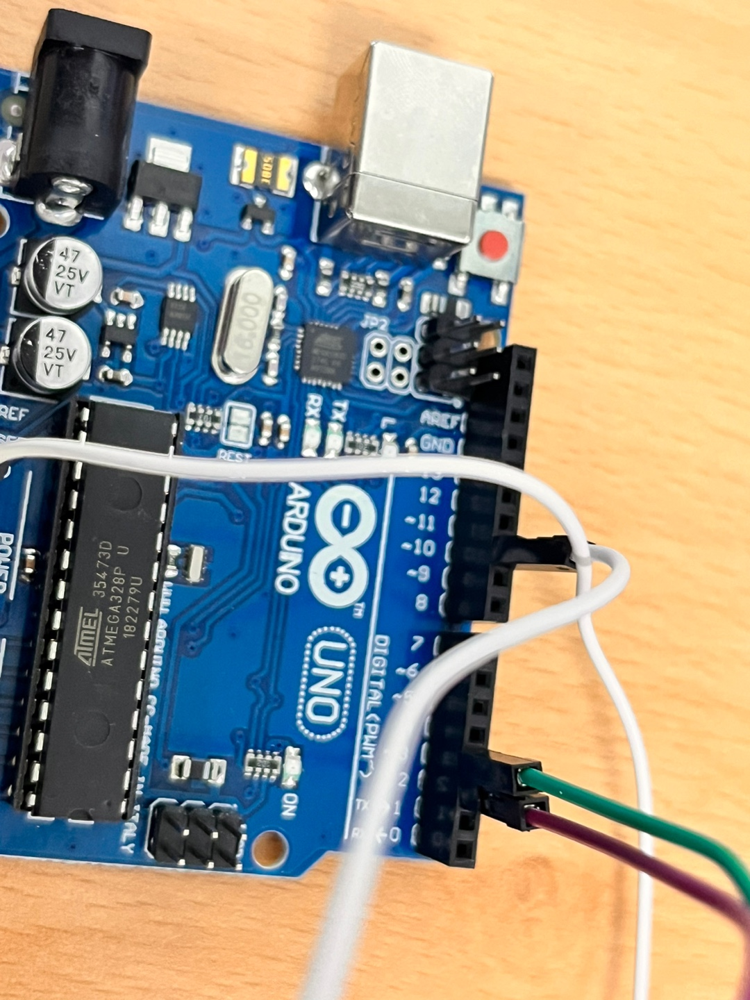


다음과 같이 모터가 돌아감


### 느낀점
* 소프트웨어와 하드웨어의 차이점을 생각해봄  
소프트웨어 : 추상화된 레벨에서 간단히 설정을 바꾸는 것이 가능함  
하드웨어 : 뭐 하나 바꾸는 것이 어려움, 시스템이 정상적으로 설계가 된 것이고 그대로 만들어졌는지 확인을 해야함  

* 디버그가 소프트웨어는 코드르 몇 줄로 가능하지만 하드웨어는 밑바닥 부터 이해가 필요하고 디버그도 더욱이 어려움  

* 다음번에 전압강하문제에 대해서 대처하기 위해서 왜 이러한 현상이 발생을 했고, 이럴때 어떻게 해결해야하는지 정리가 필요해보임  

* 부품이 끼워넣을수 있다고 끼워 넣는 것이 아니라 부품에 대한 이해를 바탕으로 조금더 체계적으로 접근이 필요해보임  

* 제품 스펙 또는 명세서는 폼이 아니라 보고 참고해야하는 파일이다.

* `몰라도 할 수 있다`

#### 회로를 돌리기 위해서 도움을 주신 분들 감사합니다
